# Customer/Lead Image Upload POC

A proof-of-concept implementation demonstrating a Customer/Lead Image Upload feature using Clean Architecture principles in .NET 8.

## 📋 POC Objectives

This POC demonstrates the implementation of a customer image management system with the following core requirements:

- **Image Upload**: Allow users to upload multiple images to customer/lead profiles
- **Storage Limit**: Enforce a maximum of 10 images per customer/lead
- **Data Format**: Store images as Base64-encoded strings
- **RESTful API**: Provide complete CRUD operations for image management
- **Clean Architecture**: Showcase separation of concerns and maintainable code structure

**Estimated Development Time**: 1 hour for backend implementation

## 🏗️ Architecture Overview

This POC implements Uncle Bob's Clean Architecture to demonstrate enterprise-level software design principles in a simplified context.

### Why Clean Architecture for this POC?

Clean Architecture was chosen for this POC to demonstrate:

1. **Separation of Concerns**: Business logic independent of frameworks and storage mechanisms
2. **Testability**: Core business rules can be tested in isolation
3. **Flexibility**: Easy to swap storage implementations (JSON → Database)
4. **Maintainability**: Clear layer boundaries and dependency management
5. **Enterprise Readiness**: Scalable foundation for production systems

### Architecture Layers

```mermaid
graph TB
    subgraph "Clean Architecture Layers"
        A[🌐 API Layer<br/>Controllers, DTOs, Middleware]
        B[🏢 Domain Layer<br/>Entities, Use Cases, Business Rules]
        C[💾 Data Layer<br/>Repositories, JSON Storage]

        A --> B
        C --> B
        B --> D[Core Business Logic<br/>Image Validation, Customer Management]
    end

    subgraph "Dependency Direction"
        E[External] --> F[Infrastructure] --> G[Application] --> H[Domain]
    end

    style B fill:#e1f5fe
    style D fill:#f3e5f5
```



### Project Structure

```
Malte.Clean.API/
├── src/
│   ├── Malte.Clean.API/           # 🌐 Web API Layer
│   │   ├── Controllers/           # REST endpoints
│   │   ├── DTOs/                  # Data transfer objects
│   │   └── Middleware/            # Error handling
│   ├── Malte.Clean.Domain/        # 🏢 Domain Layer
│   │   ├── Entities/              # Core business entities
│   │   ├── UseCases/              # Business use cases
│   │   ├── Services/              # Domain services
│   │   └── Repositories/          # Repository interfaces
│   └── Malte.Clean.Data/          # 💾 Infrastructure Layer
│       ├── Repositories/          # JSON repository implementations
│       └── Storage/               # File system operations
└── data/                          # JSON data files
```

## 📊 Storage Strategy

### JSON Storage (Current Implementation)

**Why JSON for this POC?**

- ✅ **Rapid Development**: No database setup required
- ✅ **Simplicity**: Easy to inspect and modify data during development
- ✅ **Portability**: Self-contained solution, easy to demo
- ✅ **Version Control**: Data changes are trackable in git
- ✅ **Zero Dependencies**: No external database requirements

### Database Migration Path

The Clean Architecture design allows seamless migration to a database solution:


**Proposed Database Schema:**

```sql
-- Customers Table
CREATE TABLE Customers (
    Id UNIQUEIDENTIFIER PRIMARY KEY DEFAULT NEWID(),
    Name NVARCHAR(255) NOT NULL,
    Email NVARCHAR(255) NOT NULL,
    PhoneNumber NVARCHAR(50),
    Address NVARCHAR(500),
    CreatedAt DATETIME2 DEFAULT GETUTCDATE(),
    UpdatedAt DATETIME2 DEFAULT GETUTCDATE()
);

-- Customer Images Table
CREATE TABLE CustomerImages (
    Id UNIQUEIDENTIFIER PRIMARY KEY DEFAULT NEWID(),
    CustomerId UNIQUEIDENTIFIER NOT NULL,
    Base64Data NVARCHAR(MAX) NOT NULL,
    FileName NVARCHAR(255) NOT NULL,
    ContentType NVARCHAR(100) NOT NULL,
    SizeInBytes BIGINT NOT NULL,
    UploadedAt DATETIME2 DEFAULT GETUTCDATE(),
    FOREIGN KEY (CustomerId) REFERENCES Customers(Id) ON DELETE CASCADE
);

-- Performance Index
CREATE INDEX IX_CustomerImages_CustomerId ON CustomerImages(CustomerId);
```

## 🖼️ Image Storage Options

### Base64 Storage (Current Implementation)

**Why Base64 for this POC?**

✅ **Advantages:**
- Simple integration with JSON storage
- No file system dependencies
- Atomic operations (data + metadata together)
- Easy serialization/deserialization
- Built-in data integrity

⚠️ **Considerations:**
- ~33% size increase over binary
- Memory intensive for large images
- Limited by JSON parser constraints

### Alternative Storage Strategies

#### 1. Physical File Storage


**Implementation:**
- Store files in structured directory: `/uploads/customers/{customerId}/{imageId}.{ext}`
- Database stores file paths and metadata only
- Serve images through static file endpoints

**Benefits:**
- Reduced database size
- Better performance for large images
- Standard file handling

#### 2. Cloud Storage Integration


**Cloud Storage Benefits:**
- Scalable storage capacity
- Built-in CDN capabilities
- Automatic backups and redundancy
- Global availability

## 🔄 API Flow Diagrams

### Image Upload Flow


### Image Retrieval Flow


## 🛠️ Getting Started

### Prerequisites
- .NET 8 SDK
- Any IDE (Visual Studio, VS Code, JetBrains Rider)

### Quick Start

```bash
# Clone and navigate to project
git clone <repository-url>
cd Malte.Clean.API

# Restore dependencies
dotnet restore

# Build the solution
dotnet build

# Run the API
dotnet run --project src/Malte.Clean.API
```

The API will be available at:
- HTTPS: `https://localhost:7159`
- HTTP: `http://localhost:5159`
- Swagger UI: `https://localhost:7159/swagger`

### API Endpoints

| Method | Endpoint | Description |
|--------|----------|-------------|
| `POST` | `/api/customers/{customerId}/images` | Upload one or more images |
| `GET` | `/api/customers/{customerId}/images` | List all customer images |
| `DELETE` | `/api/customers/{customerId}/images/{imageId}` | Delete specific image |
| `GET` | `/api/customers/{customerId}` | Get customer details |

### Example Usage

```bash
# Upload images to customer
curl -X POST "https://localhost:7159/api/customers/{customerId}/images" \
  -H "Content-Type: application/json" \
  -d '{
    "images": [
      {
        "base64Data": "data:image/jpeg;base64,/9j/4AAQSkZJRg...",
        "fileName": "profile.jpg",
        "contentType": "image/jpeg"
      }
    ]
  }'

# Get customer images
curl -X GET "https://localhost:7159/api/customers/{customerId}/images"

# Delete specific image
curl -X DELETE "https://localhost:7159/api/customers/{customerId}/images/{imageId}"
```

## 🧪 Business Rules

- **Maximum Images**: 10 images per customer/lead (enforced in domain layer)
- **Supported Formats**: JPEG, PNG, GIF (validated by content type)
- **File Size Limit**: 5MB per image (configurable)
- **Unique Identifiers**: All entities use GUIDs for consistency

## 🚀 Future Enhancements

- [ ] **Database Migration**: Move from JSON to SQL Server/PostgreSQL
- [ ] **Unit Testing**: Comprehensive test coverage for all layers
- [ ] **Integration Testing**: End-to-end API testing
- [ ] **Image Compression**: Automatic image optimization
- [ ] **Cloud Storage**: AWS S3/Azure Blob integration
- [ ] **Caching**: Redis implementation for performance
- [ ] **Authentication**: JWT-based security
- [ ] **Frontend**: React/Angular image management UI

## 📁 Sample Data Structure

```json
{
  "customers": [
    {
      "id": "123e4567-e89b-12d3-a456-426614174000",
      "name": "John Doe",
      "email": "john@example.com",
      "phoneNumber": "+1234567890",
      "address": "123 Main St, City, Country",
      "images": [
        {
          "id": "456e7890-e89b-12d3-a456-426614174001",
          "customerId": "123e4567-e89b-12d3-a456-426614174000",
          "base64Data": "data:image/jpeg;base64,/9j/4AAQSkZJRg...",
          "fileName": "profile.jpg",
          "contentType": "image/jpeg",
          "sizeInBytes": 1024000,
          "uploadedAt": "2025-09-15T10:00:00Z"
        }
      ],
      "createdAt": "2025-09-15T09:00:00Z",
      "updatedAt": "2025-09-15T10:00:00Z"
    }
  ]
}
```

## 🤝 Contributing

This is a POC project demonstrating Clean Architecture principles. The implementation focuses on showcasing architectural patterns rather than production-ready features.

---

**Note**: This POC prioritizes architectural demonstration over production concerns like security, performance optimization, and comprehensive error handling. It serves as a foundation for enterprise-level application development.