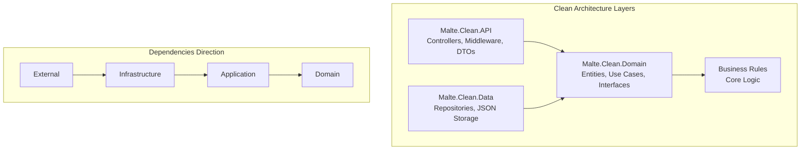
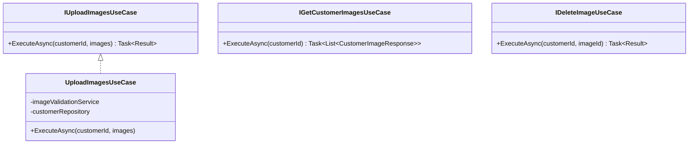
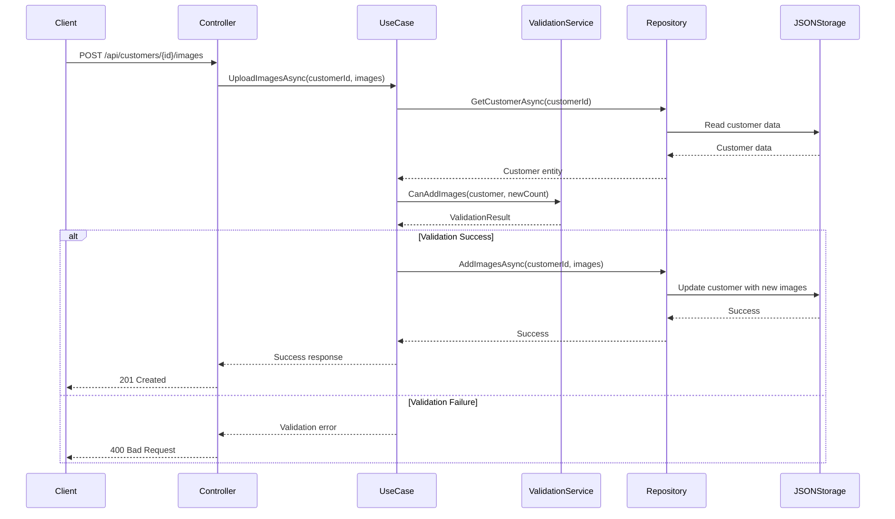
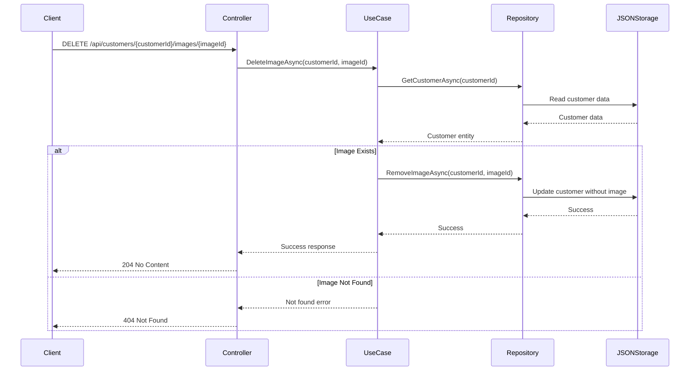

# Customer/Lead Image Upload Feature - Clean Architecture Design Document

## Overview

This document outlines the design and implementation strategy for a Customer/Lead Image Upload feature using Clean Architecture principles in .NET 8. The solution will allow users to upload, view, and manage up to 10 images per customer/lead profile.

**Current Phase Scope:** This initial implementation focuses on establishing the core backend architecture and API functionality. Testing implementation (unit and integration tests) is planned for future development phases to maintain development velocity while establishing solid architectural foundations.

## Architecture Approach

### Clean Architecture Principles

We'll implement Uncle Bob's Clean Architecture with the following key benefits:
- **Independence of Frameworks**: Business rules don't depend on external frameworks
- **Testability**: Business rules can be tested without UI, Database, or external elements
- **Independence of UI**: UI can change easily without changing the rest of the system
- **Independence of Database**: Business rules are not bound to the database
- **Independence of External Agencies**: Business rules don't know about outside interfaces

### Architecture Layers



## Project Structure

```
Malte.Clean.API/
├── src/
│   ├── Malte.Clean.API/           # Web API Layer (Controllers, Middleware)
│   ├── Malte.Clean.Domain/        # Domain Layer (Entities, Use Cases)
│   └── Malte.Clean.Data/          # Infrastructure Layer (Repositories, JSON Storage)
└── test/
    ├── Malte.Clean.API.UnitTests/        # Unit Tests
    └── Malte.Clean.API.IntegrationTests/ # Integration Tests
```

## Domain Model

### Core Entities

```csharp
// Malte.Clean.Domain/Entities/Customer.cs
public class Customer
{
    public Guid Id { get; set; }
    public string Name { get; set; }
    public string Email { get; set; }
    public string PhoneNumber { get; set; }
    public string Address { get; set; }
    public List<CustomerImage> Images { get; set; } = new();
    public DateTime CreatedAt { get; set; }
    public DateTime UpdatedAt { get; set; }
}

// Malte.Clean.Domain/Entities/CustomerImage.cs
public class CustomerImage
{
    public Guid Id { get; set; }
    public Guid CustomerId { get; set; }
    public string Base64Data { get; set; }
    public string FileName { get; set; }
    public string ContentType { get; set; }
    public long SizeInBytes { get; set; }
    public DateTime UploadedAt { get; set; }
}
```

### Business Rules (Domain Services)

```csharp
// Malte.Clean.Domain/Services/ImageValidationService.cs
public class ImageValidationService
{
    private const int MaxImagesPerCustomer = 10;
    private const long MaxImageSizeBytes = 5 * 1024 * 1024; // 5MB
    
    public ValidationResult CanAddImages(Customer customer, int newImagesCount)
    {
        if (customer.Images.Count + newImagesCount > MaxImagesPerCustomer)
        {
            return ValidationResult.Failure($"Cannot exceed {MaxImagesPerCustomer} images per customer");
        }
        return ValidationResult.Success();
    }
}
```

## Data Storage Structure (JSON)

### JSON Schema

```json
{
  "customers": [
    {
      "id": "uuid",
      "name": "John Doe",
      "email": "john@example.com",
      "phoneNumber": "+1234567890",
      "address": "123 Main St, City, Country",
      "images": [
        {
          "id": "uuid",
          "customerId": "uuid",
          "base64Data": "data:image/jpeg;base64,/9j/4AAQSkZJRgABAQAAAQ...",
          "fileName": "profile.jpg",
          "contentType": "image/jpeg",
          "sizeInBytes": 1024000,
          "uploadedAt": "2025-09-15T10:00:00Z"
        }
      ],
      "createdAt": "2025-09-15T09:00:00Z",
      "updatedAt": "2025-09-15T10:00:00Z"
    }
  ]
}
```

## API Endpoints Design

### RESTful API Endpoints

```
POST   /api/customers/{customerId}/images     # Upload one or more images
GET    /api/customers/{customerId}/images     # List all images for customer
DELETE /api/customers/{customerId}/images/{imageId} # Delete specific image
GET    /api/customers/{customerId}            # Get customer details
```

### Request/Response DTOs

```csharp
// Upload Image Request
public class UploadImageRequest
{
    public List<ImageUploadDto> Images { get; set; }
}

public class ImageUploadDto
{
    public string Base64Data { get; set; }
    public string FileName { get; set; }
    public string ContentType { get; set; }
}

// Response DTOs
public class CustomerImageResponse
{
    public Guid Id { get; set; }
    public string Base64Data { get; set; }
    public string FileName { get; set; }
    public string ContentType { get; set; }
    public DateTime UploadedAt { get; set; }
}
```

## Use Cases (Application Layer)

### Core Use Cases



## Sequence Diagrams

### Image Upload Flow



### Image Deletion Flow



## Error Handling Strategy

### Global Exception Handling

```csharp
public class GlobalExceptionHandlingMiddleware
{
    public async Task InvokeAsync(HttpContext context, RequestDelegate next)
    {
        try
        {
            await next(context);
        }
        catch (ValidationException ex)
        {
            await HandleValidationException(context, ex);
        }
        catch (NotFoundException ex)
        {
            await HandleNotFoundException(context, ex);
        }
        catch (Exception ex)
        {
            await HandleGenericException(context, ex);
        }
    }
}
```

### Custom Exception Types

```csharp
public class ValidationException : Exception
{
    public List<string> Errors { get; }
    public ValidationException(string message) : base(message) { }
    public ValidationException(List<string> errors) : base(string.Join(", ", errors))
    {
        Errors = errors;
    }
}

public class NotFoundException : Exception
{
    public NotFoundException(string message) : base(message) { }
}

public class ImageLimitExceededException : ValidationException
{
    public ImageLimitExceededException() : base("Maximum number of images (10) exceeded for this customer") { }
}
```

## Repository Pattern Implementation

### Interface Definition

```csharp
// Malte.Clean.Domain/Repositories/ICustomerRepository.cs
public interface ICustomerRepository
{
    Task<Customer?> GetByIdAsync(Guid id);
    Task<List<Customer>> GetAllAsync();
    Task<Customer> CreateAsync(Customer customer);
    Task<Customer> UpdateAsync(Customer customer);
    Task<bool> DeleteAsync(Guid id);
    Task<List<CustomerImage>> GetCustomerImagesAsync(Guid customerId);
    Task<CustomerImage?> GetCustomerImageAsync(Guid customerId, Guid imageId);
    Task AddImageAsync(Guid customerId, CustomerImage image);
    Task<bool> RemoveImageAsync(Guid customerId, Guid imageId);
}
```

## Testing Strategy (Future Implementation)

### Unit Testing Approach

The Clean Architecture design facilitates comprehensive unit testing by isolating business logic from external dependencies. The testing strategy will focus on:

**Domain Layer Testing:**
- Business rule validation (10-image limit enforcement)
- Entity behavior and state management
- Domain services and validation logic

**Use Case Testing:**
- Input validation and business logic execution
- Error handling scenarios
- Mocking external dependencies (repositories, services)

**Repository Testing:**
- JSON file operations (CRUD operations)
- Data consistency and file locking mechanisms
- Error scenarios (file not found, corruption, etc.)

### Integration Testing Approach

Integration tests will validate the complete request-response cycle and ensure proper component interaction:

**API Integration Tests:**
- Complete HTTP request/response validation
- End-to-end workflows (upload → retrieve → delete)
- Error response formatting and status codes
- Content type and payload validation

**Infrastructure Integration Tests:**
- JSON file storage operations
- File system interactions and permissions
- Concurrent access scenarios

### Testing Framework Selection

**XUnit Framework:** Primary testing framework for both unit and integration tests
- Excellent .NET Core integration
- Support for dependency injection in test scenarios
- Parallel test execution capabilities
- Theory-based testing for multiple input scenarios

**Test Project Structure:**
- `Malte.Clean.API.UnitTests` - Isolated component testing
- `Malte.Clean.API.IntegrationTests` - End-to-end API testing

### Testing Benefits in Clean Architecture

1. **Testable Design:** Business logic isolated from infrastructure concerns
2. **Mock-Friendly:** Interface-based design enables easy mocking
3. **Fast Execution:** Domain tests run without external dependencies
4. **Reliable Integration:** API tests validate complete workflows
5. **Regression Prevention:** Comprehensive coverage protects against breaking changes

## Key Implementation Considerations

### 1. Image Size and Storage Optimization
- **Base64 Encoding**: Increases size by ~33%, consider implications for JSON storage
- **File Size Limits**: Implement max file size validation (suggested: 5MB per image)
- **Image Compression**: Consider implementing client-side or server-side compression

### 2. Performance Considerations
- **JSON File Locking**: Implement file locking mechanism for concurrent access
- **Memory Usage**: Large Base64 strings will consume significant memory
- **Caching**: Consider implementing in-memory caching for frequently accessed customers

### 3. Security Measures
- **File Type Validation**: Validate image MIME types and file signatures
- **Content Scanning**: Basic validation to ensure uploaded content is actually an image
- **Input Sanitization**: Sanitize all string inputs to prevent injection attacks

### 4. Scalability Considerations
- **Database Migration Path**: Design JSON structure to facilitate future database migration
- **API Versioning**: Implement versioning strategy for future enhancements
- **Pagination**: Consider implementing pagination for customer lists with many images

## Future Database Schema (Reference)

When migrating from JSON to a proper database, consider this schema:

```sql
-- Customers Table
CREATE TABLE Customers (
    Id UNIQUEIDENTIFIER PRIMARY KEY DEFAULT NEWID(),
    Name NVARCHAR(255) NOT NULL,
    Email NVARCHAR(255) NOT NULL,
    PhoneNumber NVARCHAR(50),
    Address NVARCHAR(500),
    CreatedAt DATETIME2 DEFAULT GETUTCDATE(),
    UpdatedAt DATETIME2 DEFAULT GETUTCDATE()
);

-- Customer Images Table
CREATE TABLE CustomerImages (
    Id UNIQUEIDENTIFIER PRIMARY KEY DEFAULT NEWID(),
    CustomerId UNIQUEIDENTIFIER NOT NULL,
    Base64Data NVARCHAR(MAX) NOT NULL,
    FileName NVARCHAR(255) NOT NULL,
    ContentType NVARCHAR(100) NOT NULL,
    SizeInBytes BIGINT NOT NULL,
    UploadedAt DATETIME2 DEFAULT GETUTCDATE(),
    FOREIGN KEY (CustomerId) REFERENCES Customers(Id) ON DELETE CASCADE
);

-- Index for performance
CREATE INDEX IX_CustomerImages_CustomerId ON CustomerImages(CustomerId);
```

## Development Checklist

### Current Phase - Backend Implementation
- [ ] Set up Clean Architecture project structure
- [ ] Implement domain entities and business rules
- [ ] Create repository interfaces and JSON implementation
- [ ] Implement use cases with proper validation
- [ ] Create API controllers with proper error handling
- [ ] Add global exception handling middleware
- [ ] Implement basic logging
- [ ] Create JSON data storage structure
- [ ] Validate API endpoints functionality

### Future Phases - Quality Assurance & Enhancement
- [ ] **Testing Implementation** (Future Phase)
  - Unit tests for all use cases and domain logic
  - Integration tests for API endpoints
  - Test coverage for error scenarios and edge cases
  - Performance testing with large images
- [ ] **Documentation and Quality** (Future Phase)
  - API documentation (Swagger/OpenAPI)
  - Code documentation and comments
  - README with setup instructions
  - Architecture decision records (ADRs)
- [ ] **Production Readiness** (Future Phase)
  - Database migration strategy
  - Performance optimization
  - Security hardening
  - Monitoring and observability

## Conclusion

This Clean Architecture approach provides a solid foundation for the Customer/Lead Image Upload feature. The current phase focuses on establishing a robust backend implementation that emphasizes:

### Current Development Focus:
- **Separation of Concerns**: Each layer has distinct responsibilities
- **Clean Code Structure**: Organized following SOLID principles
- **Business Logic Isolation**: Core rules independent of infrastructure
- **Flexible Storage**: JSON-based approach for rapid development
- **Future-Ready Architecture**: Easy migration path to database solutions

### Future Enhancement Considerations:
- **Comprehensive Testing**: Unit and integration testing framework ready for implementation
- **Production Readiness**: Performance optimization and security hardening
- **Documentation**: API documentation and architectural decision records
- **Scalability**: Database migration and advanced features

The JSON-based storage approach allows for rapid prototyping and demonstration of Clean Architecture principles while maintaining a structure that supports future growth and enterprise-level requirements. This foundation will enable effective presentation to development teams and provide a clear roadmap for project evolution.